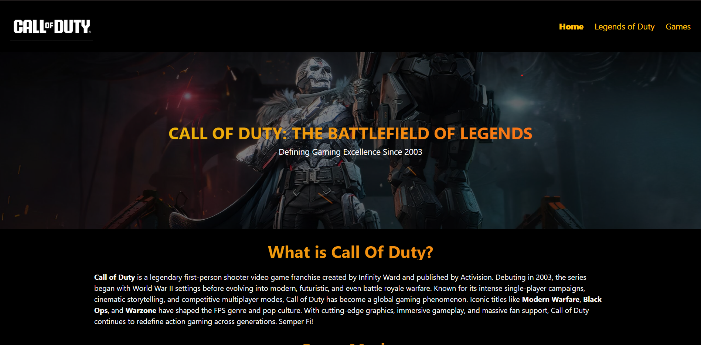
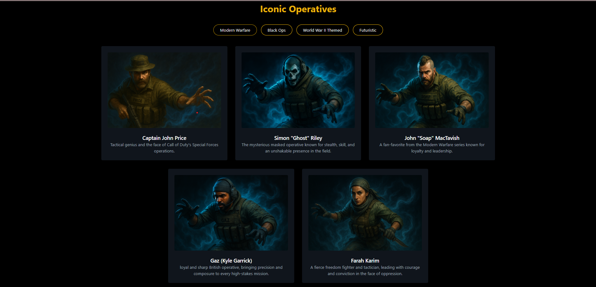
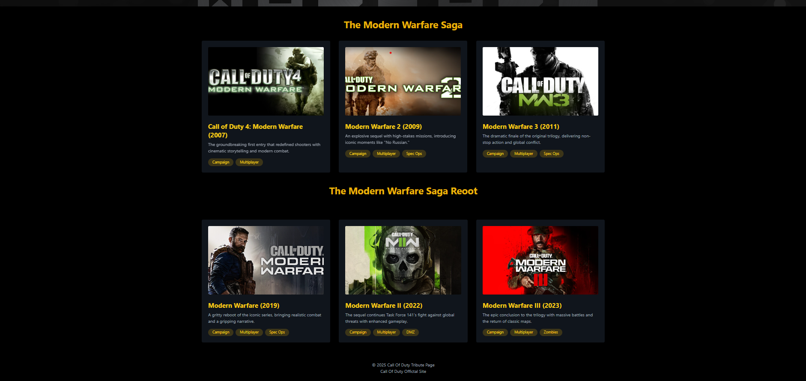

# 🎖️ Call of Duty Tribute Page

Welcome to the Call of Duty Tribute Page!
This fan-made website celebrates the entire Call of Duty legacy — spanning across the Modern Warfare, Black Ops, World War II, and Futuristic timelines. Whether you're drawn to gritty realism, historical warfare, covert operations, or futuristic combat, this page honors the heroes, gameplay, and unforgettable stories that define one of the most iconic franchises in gaming history.

## 📖 Description

This tribute website showcases every main game in the Call of Duty universe by dividing them into four core series:

- Modern Warfare Series (2007–2023)
- Black Ops Series (2010–2024)
- World War II–Themed Titles
- Futuristic Titles (Advanced Warfare, Infinite Warfare, etc.)

Each series features individual game pages with banners, character spotlights, trailers, multiplayer highlights, and lore. A dedicated "Legends of Duty" section showcases operatives from all timelines.

## 🌐 Live Demo

[Link to live site](https://call-of-duty-tribute.netlify.app/)

## 🎮 Features

- 🎯 Game Tributes
  Explore detailed pages for each major Call of Duty title — from Call of Duty (2003) to Black Ops 6 (2024)

- 🧍‍♂️ Legends of Duty
  Gallery of iconic operatives including Captain Price, Soap, Ghost, Mason, Woods, Reznov, Raul Menendez, and many more

- 🗺️ Organized Game Categories
  Titles grouped into:
  - Modern Warfare Series
  - Black Ops Series
  - World War II–Themed Games
  - Futuristic Games

- 📸 Visual Content
  Banners, screenshots, character art, and embedded trailers

- 🧭 Intuitive Navigation
  Fixed header with series dropdowns and section links

- 📱 Fully Responsive Design
  Optimized for desktops, tablets, and mobile devices

## 🛠️ Technologies Used

- HTML5 — for page structure
- Tailwind CSS — for modern, utility-first styling
- Bootstrap 4 & 5 — for layout, responsiveness, and components
- Bootstrap Icons — used for minimal iconography
- Embedded YouTube — for cinematic trailers

## 📸 Screenshots

    
    
    

## License

This project is open-source and available under the MIT License.

## Author

**Divyansh Garg**

## Contact

- 📧 Email: divyanshgarg3105@gmail.com
- 🌐 GitHub: [GitHub Profile](https://github.com/Divyansh3105)
